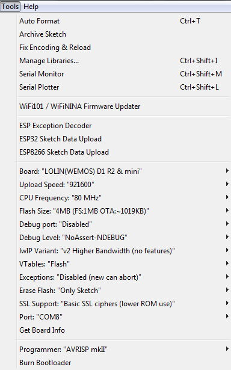

# Is it actually an "issue"?

Suggestions, improvements, specific changes / additions requests etc are *not* "issues". If you want to discuss those matters, we would love you to join us in the [Facebook H4 Support / Discussion group](https://www.facebook.com/groups/444344099599131/) set up specifcially for that purpose.

"Issues" should be restricted to code not behaving as described, crashes, confusing / unclear / broken documentation etc. Keep it to things that simply *just don't work*, **not** "Things that don't work the way *you* would like them to or think they *should*".

# For genuine Issues

The bottom line is: If I cannot find the problem, I can't fix it. This document explains the ways in which you can help me to find and fix any genuine bugs or other problems with the code.

If you raise an issue without providing the information outlined here, It will not be looked at, it's that simple. If you genuinely want your problem fixed, please provide *all* of the following:

---

# Mandatory steps

1. If you are using PlatformIO and are getting a compile / build error, leave now: it's a PlatformIO problem. Until PlatformIO make their IDE 100% compatible with ArduinoIDE, I am only able to provide support for ArduinoIDE users.

2. Read *all* of the relevant documentation for the plugins you are using.

3. Check the [Known Issues / FAQs](faq.md)

4. Provide the type / name of the development board you are using and the major Tools / Build settings from ArduinoIDE. Its not a huge effort, a small screen snip like this will suffice using snip or PrintScreen key ***DO  NOT TAKE PHOTOS OF YOUR SCREEN***. If it's a homebuild, include schematic or circuit diagram.



5. Edit [config.h](../src/config.h) and ensure H4P_LOG_EVENTS is set to 1

6. Change the mandatory preamble to the following and make sure your IDE and libraries are at the correct version levels [as stated here](../README.md#installation) before recompiling

```cpp
H4_USE_PLUGINS(115200,30,false)
H4P_VerboseMessages vm;
H4P_SerialLogger sl;
```

7. Include the cut and pasted *text* of the entire serial monitor output from the start of the boot. ***DO  NOT TAKE PHOTOS OF YOUR SCREEN***

8. Include the *entire code* of the **MVCE** (see below) that shows the error, or a link to a repo or pastebin etc. If you are using additional libraries, include links so that I can download them too. If I can't compile and run your code, I can't find the bug!

9. If the problem includes a crash, you ***must*** provide a ***decoded*** stack trace. A raw stack trace is useless and will just delay solving the problem. Do **not** include raw stack traces. You will need to download and install the [ESP Exception Decoder](https://github.com/me-no-dev/EspExceptionDecoder)

---

# Your code - MVCE

Your code should be a **M**inimal, **C**omplete and **V**erifiable **E**xample (**MCVE**).

This means that I need to see *everything* ("complete") to be able to reproduce the problem, but I need "*everything*" to be as small as possible ("minimal"). Of course it must also actually show the problem clearly ("Verifiable").

When you explain the problem you should explain what you *expect* to happen and usually *why*. Then your MVCE should show a different result.


## What's in an MCVE?

More important is what is *not* in it: and that is anything that does not contribute or work towards causing the problem. If I can take out *any* code and still compile the sketch and it still shows the problem, then it is *not* "minimal" and you shoud have already done that. I do not have time to waste looking at code that does nothing to cause the problem, so: if in doubt, ***TAKE IT OUT***

What's *in* it is the smallest possible amount of code that shows the problem.

---

# Additional advice

To reduce the amount of time taken to solve the issue, here are some guidelines that will speed things up:

1. If I ask for additional information, *just provide **exactly** what I ask for*. Please don't try to second guess me and give me something *more* or *different* or *"better"* or that you think might also help... Also, please don't ask me *why* I need it - no matter how irrelevant it may sound to *you*, it just wastes time. *I* know what I need to know - trust me - I am not going to waste both our time asking for extra stuff I know I don't need! So the fact I ask means I know I need it, so just give it to me. I will explain *why* I needed it *after* I have solved the problem.

2. If at any point you find yourself needing to say "I can't give you that, it's proprietary" then you are already in the wrong place - we need to be discussing a formal support contract. I am more than happy to sign any NDAs and be paid market rates to help you get your private code working with my free public code.

---

(c) 2021 Phil Bowles h4plugins@gmail.com

* [Facebook H4  Support / Discussion](https://www.facebook.com/groups/444344099599131/)
* [Facebook General ESP8266 / ESP32](https://www.facebook.com/groups/2125820374390340/)
* [Facebook ESP8266 Programming Questions](https://www.facebook.com/groups/esp8266questions/)
* [Facebook ESP Developers (moderator)](https://www.facebook.com/groups/ESP8266/)
* [Support me on Patreon](https://patreon.com/esparto)